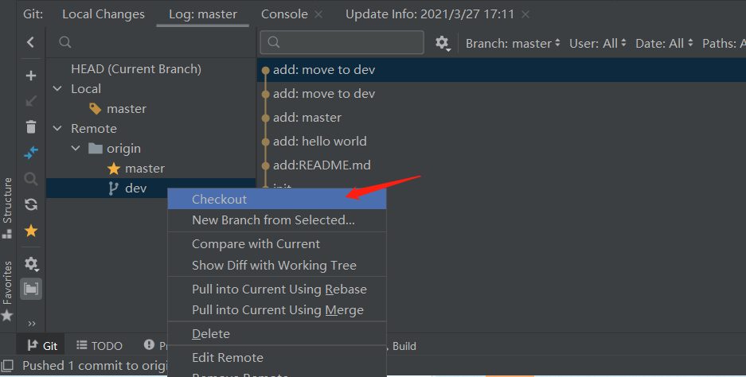
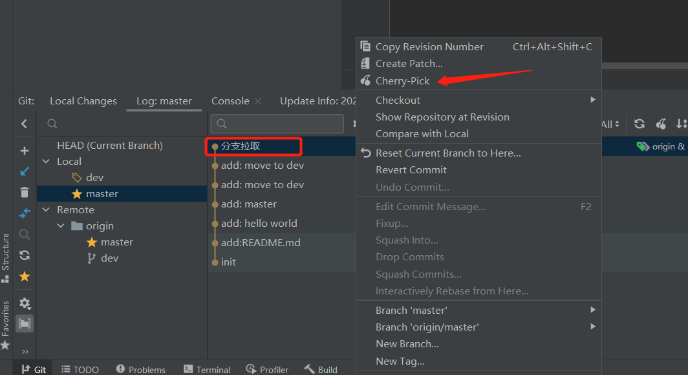

# 测试git命令
### 1. 拉取其它分支代码 
开始时只有master分支，想要切换dev分支，把远程仓库dev代码拉取下来。
在Remote中找到需要拉取的其它分支，右键点击Checkout，拉取相应分支代码并自动切换到该分支


### 2. 将某分支的某次提交合并到另一分支
代码开发的时候，有时需要把某分支（比如dev）的某一次提交合并到另一分支（比如master），这就需要用到git cherry-pick命令。
先切换到需要合并到的分支，然后在其它分支的log中，找到需要合并过来的commit，右键点击Cherry-Pick,
如果有冲突，需要手动解决冲突。
```
参考：http://www.ruanyifeng.com/blog/2020/04/git-cherry-pick.html
```
